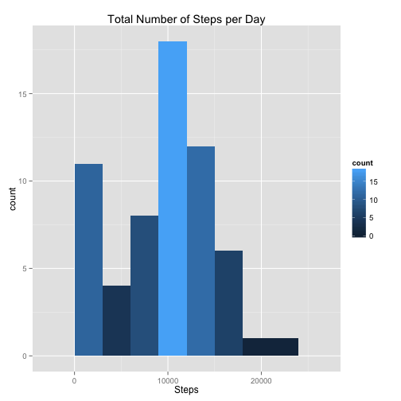
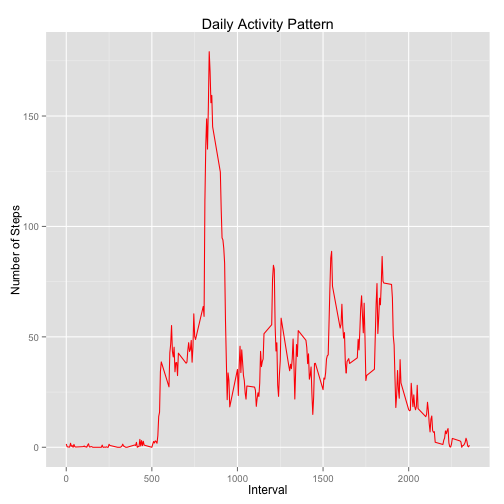
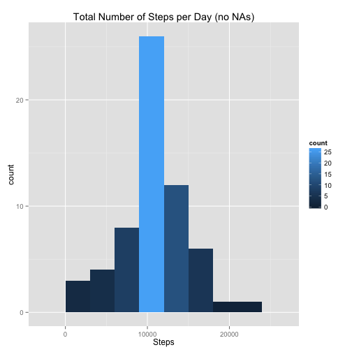
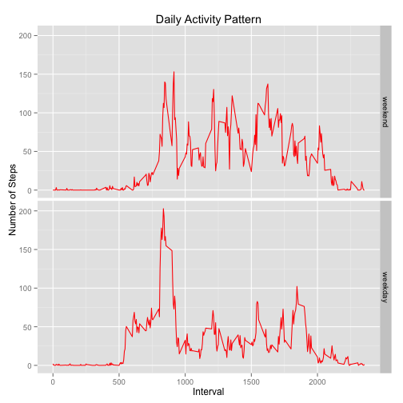

---
output:
  html_document: default
---
# Reproducible Research: Peer Assessment 1

Hi! Thanks for taking the time to review this assessment! We will require
the `ggplot2` and `data.table` libraries to knit this R Markdown document


```r
library(ggplot2)
library(data.table)
```


## Loading and preprocessing the data

First of all, we will extract the ZIP file with the activity date and load it up
on a data.frame object. We will pre-process and extract the step counts and intervals
as `numeric` and the date information as a `Date` object to make computation easier  


```r
df.activity = read.csv(unz("activity.zip", "activity.csv"), header = T, sep = ",", 
    stringsAsFactors = F, na.strings = "NA", colClasses = c("numeric", "Date", 
        "numeric"))

dt.activity = data.table(df.activity)
rm(df.activity)
dt.activity
```

```
##        steps       date interval
##     1:    NA 2012-10-01        0
##     2:    NA 2012-10-01        5
##     3:    NA 2012-10-01       10
##     4:    NA 2012-10-01       15
##     5:    NA 2012-10-01       20
##    ---                          
## 17564:    NA 2012-11-30     2335
## 17565:    NA 2012-11-30     2340
## 17566:    NA 2012-11-30     2345
## 17567:    NA 2012-11-30     2350
## 17568:    NA 2012-11-30     2355
```


## What is mean total number of steps taken per day?

First of all, we need to combine all the steps that happened on each day


```r
dt.totalsteps = dt.activity[, sum(steps, na.rm = T), by = "date"]
head(dt.totalsteps)
```

```
##          date    V1
## 1: 2012-10-01     0
## 2: 2012-10-02   126
## 3: 2012-10-03 11352
## 4: 2012-10-04 12116
## 5: 2012-10-05 13294
## 6: 2012-10-06 15420
```


We can then create an histogram with the total steps data, and calculate their *mean* 
and *median* values, while ignoring missing values of the data


```r
qplot(dt.totalsteps$V1, geom = "histogram", binwidth = 3000, main = "Total Number of Steps per Day", 
    xlab = "Steps", fill = ..count..)
```

 

```r
median(dt.totalsteps$V1)
```

```
## [1] 10395
```

```r
mean(dt.totalsteps$V1)
```

```
## [1] 9354
```


## What is the average daily activity pattern?

This time, instead of combining per day, we will combine the steps by each interval
that we have available. on the dataset.


```r
dt.pattern = dt.activity[, sum(steps, na.rm = T)/.N, by = "interval"]
head(dt.pattern)
```

```
##    interval      V1
## 1:        0 1.49180
## 2:        5 0.29508
## 3:       10 0.11475
## 4:       15 0.13115
## 5:       20 0.06557
## 6:       25 1.81967
```


Now, we create a plot to help us visualize the pattern of daily activity averaged
over all the days.


```r
qplot(interval, V1, data = dt.pattern, xlab = "Interval", ylab = "Number of Steps", 
    color = I("red"), geom = "line", main = "Daily Activity Pattern")
```

 


We can also figure out which interval is the one that contains the maximum number
of stepts across all the days.


```r
dt.pattern[V1 == max(dt.pattern$V1)]$interval
```

```
## [1] 835
```


## Imputing missing values

First, let us verify what is the number of missing values in the dataset.


```r
sum(is.na(dt.activity$steps))
```

```
## [1] 2304
```


We will fill these missing vaules by using the mean of the specific 5-minute interval
as a replacement for the missing value. I already have these quantities calculated
in the `dt.pattern` table.


```r
dt.nomissing = copy(dt.activity)
dt.nomissing[is.na(steps), `:=`(steps, dt.pattern[dt.pattern$interval == interval]$V1)]
```

```
##          steps       date interval
##     1: 1.49180 2012-10-01        0
##     2: 0.29508 2012-10-01        5
##     3: 0.11475 2012-10-01       10
##     4: 0.13115 2012-10-01       15
##     5: 0.06557 2012-10-01       20
##    ---                            
## 17564: 4.08197 2012-11-30     2335
## 17565: 2.86885 2012-11-30     2340
## 17566: 0.55738 2012-11-30     2345
## 17567: 0.19672 2012-11-30     2350
## 17568: 0.93443 2012-11-30     2355
```

```r
sum(is.na(dt.nomissing$steps))
```

```
## [1] 0
```


Now, we again create an histogram with the total steps data, and calculate their *mean* 
and *median* values to verify the changes we made on the dataset.


```r
dt.totalsteps.noNA = dt.nomissing[, sum(steps, na.rm = T), by = "date"]
head(dt.totalsteps.noNA)
```

```
##          date    V1
## 1: 2012-10-01  9354
## 2: 2012-10-02   126
## 3: 2012-10-03 11352
## 4: 2012-10-04 12116
## 5: 2012-10-05 13294
## 6: 2012-10-06 15420
```

```r
qplot(dt.totalsteps.noNA$V1, geom = "histogram", binwidth = 3000, main = "Total Number of Steps per Day (no NAs)", 
    xlab = "Steps", fill = ..count..)
```

 

```r
median(dt.totalsteps.noNA$V1)
```

```
## [1] 10395
```

```r
mean(dt.totalsteps.noNA$V1)
```

```
## [1] 10581
```


As a result from this change, the mean got really close to the median, and the
shape of the histogram got much closer to a bell shape. The concentration of
days with less then 3000 steps got really small, as most of them were filled with
missing values, and that went to the bucket that contains the mean and median.

## Are there differences in activity patterns between weekdays and weekends?

First, let us separate our dates in weekdays and weekends so we can start splitting
the interval counts among them. For this we will create a factor variable and
add it to the dataset


```r
activity.weekdays = weekdays(dt.activity$date)
factor.weekday = factor(ifelse(activity.weekdays == "Saturday" | activity.weekdays == 
    "Sunday", "weekend", "weekday"), levels = c("weekend", "weekday"))
dt.activity[, `:=`(weekstatus, factor.weekday)]
```

```
##        steps       date interval weekstatus
##     1:    NA 2012-10-01        0    weekday
##     2:    NA 2012-10-01        5    weekday
##     3:    NA 2012-10-01       10    weekday
##     4:    NA 2012-10-01       15    weekday
##     5:    NA 2012-10-01       20    weekday
##    ---                                     
## 17564:    NA 2012-11-30     2335    weekday
## 17565:    NA 2012-11-30     2340    weekday
## 17566:    NA 2012-11-30     2345    weekday
## 17567:    NA 2012-11-30     2350    weekday
## 17568:    NA 2012-11-30     2355    weekday
```


We then proceed to do some aggregating magic with our data.table


```r
dt.pattern.week = dt.activity[, sum(steps, na.rm = T)/.N, by = c("weekstatus", 
    "interval")]
head(dt.pattern.week)
```

```
##    weekstatus interval      V1
## 1:    weekday        0 2.02222
## 2:    weekday        5 0.40000
## 3:    weekday       10 0.15556
## 4:    weekday       15 0.17778
## 5:    weekday       20 0.08889
## 6:    weekday       25 1.31111
```


Now, we create a plot to help us visualize the pattern of daily activity averaged
over weekends and weekdays.


```r
qplot(interval, V1, data = dt.pattern.week, facets = weekstatus ~ ., xlab = "Interval", 
    ylab = "Number of Steps", color = I("red"), geom = "line", main = "Daily Activity Pattern")
```

 

